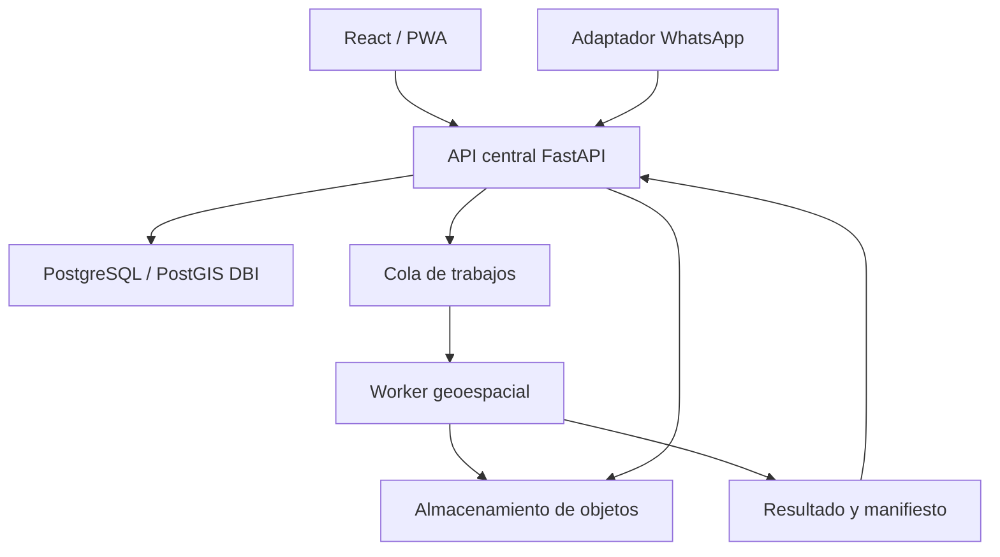

# 01 — Arquitectura del sistema

## Estado de la decisión

La arquitectura objetivo se define en `DBI-ARC-001`. `DBI-DATA-001` implementa
la primera barrera de datos: configuración DBI validada y un entorno Alembic
independiente. `DBI-MAP-001` implementa el primer contrato HTTP y consumidor
React del mapa cronológico. `DBI-DATA-002` añade el modelo persistente mínimo
de finca, lote y campaña, todavía sin aplicar migraciones o conectar la API.
`DBI-JOB-001` establece contratos versionados y reglas puras para el futuro
trabajo geoespacial, sin cola, persistencia operativa o ejecución del pipeline.
`DBI-JOB-002` añade persistencia transaccional de trabajos e intentos en
metadatos DBI, todavía sin sesión, endpoint, cola o ejecución.
`DBI-ASSET-001` añade metadatos verificables de activos de entrada y artefactos,
todavía sin sesión, repositorio, almacenamiento de objetos o ejecución.
`DBI-DATA-003` incorpora una fábrica explícita y diferida de motores y sesiones
DBI, todavía sin ciclo de vida FastAPI, repositorio, endpoint o conexión
operativa. `DBI-DATA-004` incorpora repositorios acotados por organización o
tenant y una unidad de trabajo basada en la misma frontera transaccional,
todavía sin autorización, ciclo de vida FastAPI, endpoint o conexión operativa.
`DBI-AUTH-001` añade una política pura, inmutable y cerrada por defecto para
tenant, organización, finca y lote. `DBI-AUTH-002` añade la autoridad
persistente y el resolvedor canónico, todavía sin integrar FastAPI, decodificar
JWT, aplicar migraciones o abrir una conexión.

El diseño y la evidencia están en `docs/17_ARCHITECTURE_DBI-ARC-001.md` y
`docs/18_DATABASE_ISOLATION_DBI-DATA-001.md`. El corte cartográfico se documenta
en `docs/19_MAP_TIMELINE_DBI-MAP-001.md`, el dominio agrícola en
`docs/20_AGRICULTURAL_DOMAIN_DBI-DATA-002.md`, la frontera del trabajo en
`docs/21_ANALYSIS_JOB_CONTRACT_DBI-JOB-001.md`, su persistencia en
`docs/22_ANALYSIS_JOB_PERSISTENCE_DBI-JOB-002.md` y los metadatos de objetos en
`docs/23_ASSET_PERSISTENCE_DBI-ASSET-001.md`. La frontera transaccional se
documenta en `docs/24_DBI_SESSION_FACTORY_DBI-DATA-003.md`, el acceso por
repositorios en `docs/25_DBI_REPOSITORIES_DBI-DATA-004.md`, la política de
autorización en `docs/26_DBI_AUTHORIZATION_DBI-AUTH-001.md` y la resolución de
identidad en `docs/28_DBI_IDENTITY_MEMBERSHIPS_DBI-AUTH-002.md`.

## Módulos existentes

| Componente | Ruta | Responsabilidad actual |
|---|---|---|
| Plataforma web | `apps/platform-web/frontend` | Interfaz React que consume la API HTTP |
| Backend | `apps/platform-web/backend` | API FastAPI importada de SST Compliance |
| Bot | `apps/whatsapp-bot` | Webhook Flask, conversación, Green API y persistencia en Google Sheets |
| Motor geoespacial | `services/banana-density` | CLI y pipeline local de análisis de ortofotos |

Los cuatro componentes continúan separados. El contrato cartográfico conecta
únicamente React y FastAPI. No conecta la API con PostGIS, almacenamiento de
objetos o el worker geoespacial.

## Arquitectura objetivo aprobada

### Plano de control

`apps/platform-web/backend` es el candidato aprobado para evolucionar hacia la
API central. Será propietario de identidad, autorización, organizaciones,
fincas, lotes, trabajos, metadatos, trazabilidad, aprobaciones y auditoría.

La adopción será incremental. Los routers, modelos y migraciones heredados de
SST Compliance no se renombran ni se conectan automáticamente al dominio
agrícola.

### Plano de procesamiento

`services/banana-density` evolucionará como worker independiente. Recibirá
trabajos versionados, procesará datos en almacenamiento temporal, publicará
artefactos en almacenamiento de objetos y devolverá un manifiesto de
resultados.

El motor no se importará dentro del proceso FastAPI y no será invocado mediante
una petición HTTP que espere a que termine el análisis completo.

### Adaptadores

- React y la futura PWA consumirán exclusivamente contratos de la API.
- El bot conservará Green API como transporte y su lógica conversacional
  mientras se construye un adaptador hacia la API.
- Google Sheets continuará como almacenamiento operativo del bot hasta un
  ticket de migración con conciliación y corte explícito.
- Después del corte, Sheets podrá ser una exportación o vista auxiliar, pero no
  una segunda fuente canónica.

## Propiedad de datos

| Clase de información | Fuente canónica objetivo |
|---|---|
| Usuarios, organizaciones, fincas, lotes y permisos | PostgreSQL DBI |
| Metadatos de campañas, trabajos y ejecuciones | PostgreSQL DBI |
| Geometrías operativas y resultados consultables | PostGIS DBI |
| Ortofotos, modelos, GeoPackage, PDF, XLSX y rásteres | Almacenamiento de objetos |
| Manifiestos, huellas y referencias de artefactos | PostgreSQL DBI |
| Estado del bot durante la transición | Google Sheets |
| Estado del bot después del corte aprobado | PostgreSQL DBI |

PostgreSQL/PostGIS no almacenará ortofotos, pesos de modelos ni otros binarios
pesados. La base conservará referencias, metadatos, huellas criptográficas,
estado y trazabilidad.

## Aislamiento de bases

- La plataforma nueva utilizará `DBI_DATABASE_URL`.
- `DATABASE_URL` heredada no se reutilizará ni reemplazará.
- Desarrollo, pruebas, staging y producción tendrán bases independientes.
- Staging y producción usarán servicios nuevos.
- El historial Alembic DBI será independiente.
- Las migraciones de producción requerirán aprobación explícita.
- La aplicación, el migrador y los lectores usarán roles separados.

`DBI-DATA-001` materializa estos controles sin aprovisionar infraestructura:

- `app/db/dbi_config.py` exige `DBI_ENVIRONMENT` y `DBI_DATABASE_URL`;
- los nombres autorizados son `dbi_development`, `dbi_test`, `dbi_staging` y
  `dbi_production`;
- `dbi_alembic.ini` utiliza exclusivamente `dbi_alembic/`;
- el historial DBI comienza en `dbi_0001_baseline`;
- la tabla de versión se denomina `alembic_version_dbi`;
- `alembic/`, `app/core/config.py` y `app/db/session.py` permanecen heredados.

La existencia de esta configuración no significa que una base, esquema, rol o
extensión haya sido creado. Cualquier migración online requiere un ticket y una
aprobación explícitos.

## Mapa cronológico v1

`DBI-MAP-001` añade dos superficies coordinadas:

- la ruta React protegida `/fincas/:fincaId/mapa`;
- `GET /api/v1/dbi/farms/{farm_id}/map/timeline`.

El endpoint devuelve `farm-map-timeline.v1`, ocho tipos de capa y una cronología
vacía. La respuesta no contiene geometrías, mediciones, URLs, rutas locales o
resultados simulados.

MapLibre GL JS se ejecuta con un estilo local neutro y `sources: {}`. La
interfaz muestra carga, error y ausencia de campañas; la comparación permanece
deshabilitada hasta que existan al menos dos fechas reales.

Este corte implementa un contrato y su consumidor. No implementa finca o lote
como tablas, autorización por pertenencia de finca, campañas, tiles, artefactos
ni procesamiento geoespacial. Esas capacidades requieren persistencia DBI y
contratos de acceso autorizados en tickets posteriores.

## Dominio agrícola v1

`DBI-DATA-002` incorpora tres tablas dentro de los metadatos exclusivos de
`DBIBase`: `dbi_farms`, `dbi_plots` y `dbi_campaigns`. Lote y campaña
referencian a finca; los códigos son únicos por organización o finca y los
estados están limitados mediante restricciones explícitas.

Los UUID se generan en la aplicación. La revisión
`dbi_0002_agricultural_domain` no requiere `pgcrypto`, `uuid-ossp` o
PostGIS. Tampoco inserta datos, crea sesiones DBI o conecta el mapa con la base.

`organization_ref` permanece como referencia opaca sin clave foránea hacia la
tabla heredada `companies`. La autoridad de organizaciones y permisos se
definirá en un ticket específico antes de habilitar acceso operativo.

## Contrato de trabajo geoespacial v1

`DBI-JOB-001` implementa `analysis-job-command.v1`,
`analysis-job-result.v1`, `artifact-manifest.v1` y
`agronomic-finding.v1`. Los modelos de la API rechazan campos desconocidos,
rutas locales, URLs de activos y manifiestos sin tamaño o huella válida.

La máquina de estados permite `accepted`, `queued`, `running`, `succeeded`,
`failed`, `cancel_requested` y `canceled`. Repetir un estado es un no-op
idempotente; reintentar desde `failed` exige autorización explícita y los
estados terminales no pueden reabrirse.

El motor de densidad incorpora un adaptador puro que valida el mismo comando
con la biblioteca estándar. No importa el backend, no resuelve activos y no
ejecuta `run_full_pipeline`. Por tanto, este corte define una frontera, no una
orquestación operativa.

## Persistencia de trabajos geoespaciales v1

`DBI-JOB-002` incorpora `dbi_analysis_jobs` y
`dbi_analysis_job_attempts` sobre `DBIBase`. La primera tabla conserva el
estado global, referencias opacas de entrada, versiones y la huella del comando;
la segunda separa cada ejecución o reintento mediante un número único por
trabajo.

La unicidad de `tenant_ref + request_id` respalda idempotencia en la base. Los
estados, números de intento, huellas y fechas tienen restricciones explícitas.
La revisión `dbi_0003_analysis_jobs` desciende directamente del dominio
agrícola y se valida solo mediante SQL offline.

La persistencia del esquema no equivale a operación. `DBI-DATA-003` añade una
fábrica de sesiones aislada, pero todavía no existe repositorio, endpoint,
autorización, cola, almacenamiento de objetos o ejecución del worker.

## Persistencia de activos y artefactos v1

`DBI-ASSET-001` incorpora `dbi_analysis_input_assets` y
`dbi_analysis_artifacts` sobre `DBIBase`. Los activos de entrada conservan
tenant, finca, lote opcional, tipo, estado, clave relativa de objeto, MIME,
tamaño y SHA-256. Los artefactos materializan `artifact-manifest.v1` con rol,
etapa productora, objeto, huella y CRS opcional.

Una clave compuesta en los intentos permite que cada artefacto referencie
simultáneamente `attempt_id + job_id`. Así, la base no admite que el intento
pertenezca a otro trabajo. Los nueve roles y las 17 etapas permanecen alineados
con los enums del contrato.

La revisión `dbi_0004_assets_artifacts` se valida solo mediante SQL offline.
`DBI-DATA-003` aporta la fábrica transaccional, pero no existe conexión a un
bucket, resolución de objetos, URL firmada, repositorio, endpoint, cola o
ejecución del worker.

## Fábrica de sesiones DBI v1

`DBI-DATA-003` incorpora `app/db/dbi_session.py` como única frontera autorizada
para construir un motor y sesiones DBI. `create_dbi_engine()` usa
exclusivamente la configuración validada por `load_dbi_database_config()` y no
abre conexiones al importar.

`create_dbi_session_factory()` liga sesiones solo al motor DBI recibido.
`dbi_session_scope()` confirma una operación exitosa, revierte cualquier error
y cierra siempre la sesión. No existen objetos globales, integración con el
ciclo de vida FastAPI o dependencia de rutas.

La fábrica no convierte la persistencia en una capacidad operativa. Crear
repositorios, autorizar recursos, montar endpoints o conectar servicios
requiere tickets posteriores.

## Repositorios y unidad de trabajo DBI v1

`DBI-DATA-004` añade siete repositorios que reciben una sesión DBI explícita.
Finca, lote y campaña exigen `organization_ref`; trabajo, intento, activo y
artefacto exigen `tenant_ref`. Los agregados que no conservan el ámbito en una
columna propia se unen con finca o trabajo antes de filtrar.

`DBIUnitOfWork` liga los siete repositorios a la misma sesión.
`dbi_unit_of_work_scope()` reutiliza `dbi_session_scope()`, por lo que los
repositorios no confirman, revierten o cierran transacciones. La búsqueda
idempotente de trabajos conserva conjuntamente `tenant_ref + request_id`.

Este acotamiento impide consultas globales accidentales, pero no implementa
autorización. Identidad, pertenencia, ciclo de vida FastAPI y endpoints requieren
tickets posteriores. La validación compila sentencias SQLAlchemy para
PostgreSQL y usa dobles; no construye un motor ni abre conexiones.

## Política de autorización DBI v1

`DBI-AUTH-001` incorpora `DBIAccessContext` como una copia inmutable de la
identidad y los ámbitos que una futura frontera confiable haya resuelto. El
contexto conserva un tenant, organizaciones, fincas, lotes y permisos
explícitos; no acepta referencias vacías o comodines.

`DBIAuthorizationPolicy` exige coincidencia exacta en una cadena acumulativa:
permiso y tenant; luego organización; después finca; finalmente lote. Una
ausencia o diferencia genera la misma denegación sin revelar qué pertenencia
falló. Ningún permiso implica otro y `manage` no concede acceso universal.

La política no autentica, decodifica JWT, consulta `User` o `Company`, abre
sesiones ni invoca repositorios. `DBI-AUTH-002` resuelve identidad y
pertenencias en una capa separada; integrar el ciclo de vida FastAPI y montar
endpoints requiere tickets posteriores.

## Resolución canónica de identidad y membresías DBI v1

`DBI-AUTH-002` incorpora cuatro tablas normalizadas sobre `DBIBase`: principal,
membresía por tenant, permisos globales y ámbitos jerárquicos. El principal
asigna un UUID canónico a una `legacy_identity_ref` opaca. `tenant_ref` y
`organization_ref` también permanecen opacas y no crean claves foráneas hacia
`User`, `Company` u otra tabla heredada.

Los permisos se almacenan separados de los ámbitos porque
`DBIAccessContext` aplica el mismo conjunto de permisos a todos sus ámbitos.
Una membresía sin ámbitos autoriza solo el tenant. Los ámbitos de finca y lote
incorporan su cadena de organización y se contrastan con `dbi_farms` y
`dbi_plots`.

`DBIIdentityRepository` recibe una sesión explícita y
`DBIAccessContextResolver` recibe el repositorio. El resolvedor exige un único
principal y una única membresía activos, al menos un permiso reconocido y una
jerarquía consistente. Ausencia, duplicidad, inactividad, revocación o
inconsistencia producen la misma denegación externa.

Esta capa no decodifica JWT, no interpreta `ADMIN`, no crea motores o sesiones,
no abre conexiones y no está integrada con FastAPI. La revisión
`dbi_0005_identity_memberships` se valida solo mediante metadatos y SQL offline.

## Dependencias permitidas

| Origen | Destino permitido |
|---|---|
| React / PWA | API central |
| Adaptador WhatsApp | API central y Green API |
| API central | PostgreSQL/PostGIS DBI, cola y almacenamiento de objetos |
| Worker geoespacial | Cola, almacenamiento temporal y almacenamiento de objetos |
| Consumidor de resultados | API central mediante contrato versionado |

## Dependencias prohibidas

- Frontend o bot conectándose directamente a PostgreSQL/PostGIS.
- API importando PyTorch, GDAL o el pipeline geoespacial.
- Worker escribiendo directamente en tablas de dominio.
- Frontend leyendo artefactos privados sin autorización temporal.
- Uso de rutas locales del equipo del analista como contrato entre servicios.
- Reutilización de bases, credenciales o migraciones de sistemas productivos.
- Actualización automática de un modelo Champion.

## Orden de implementación gobernado

La secuencia resumida original queda sustituida por el backlog canónico de
`docs/27_MASTER_BACKLOG_DBI-PLAN-001.md`. Ese documento desglosa cada capacidad,
dependencia, resultado verificable y exclusión; los Issues #29 a #33 rastrean
los cinco hitos pendientes.

La línea base completada abarca arquitectura, aislamiento DBI, mapa vacío,
dominio agrícola, contratos y persistencia de trabajos/activos, fábrica de
sesiones, repositorios, unidad de trabajo y política de autorización offline.

El trabajo futuro se agrupa así:

1. Hito 9: identidad y membresías, ciclo de vida FastAPI, API autorizada,
   infraestructura, geometrías, migraciones y administración funcional.
2. Hito 10: almacenamiento privado, activos, trabajos, cola, registro de
   modelos, worker, resultados, mapas reales y multiespectral.
3. Hito 11: dashboard, PWA, inspecciones, agrometeorología, producción,
   empacadora, SST, biblioteca y aprobación agronómica.
4. Hito 12: adaptador del bot, conciliación con Sheets y corte reversible.
5. Hito 13: observabilidad, seguridad, rendimiento/costos, despliegues,
   continuidad y UAT.

El próximo ticket ejecutable es `DBI-AUTH-002`, rastreado en el Issue #34. Debe
resolver la autoridad de membresías y producir `DBIAccessContext` de forma
offline antes de integrar FastAPI. La existencia de un ticket o de este orden
no equivale a capacidad implementada ni autoriza conexiones, migraciones,
despliegues o cambios productivos.
