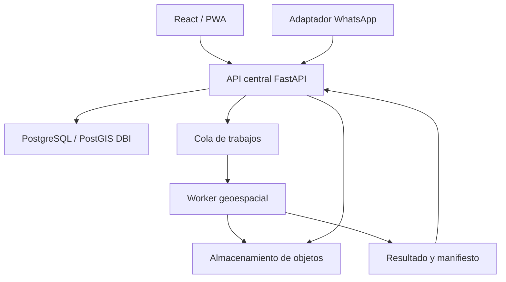

# 01 — Arquitectura del sistema

## Estado de la decisión

La arquitectura objetivo se define en `DBI-ARC-001`. `DBI-DATA-001` implementa
la primera barrera de datos: configuración DBI validada y un entorno Alembic
independiente. Ninguno de los dos tickets integra módulos o crea una base.

El diseño y la evidencia están en `docs/17_ARCHITECTURE_DBI-ARC-001.md` y
`docs/18_DATABASE_ISOLATION_DBI-DATA-001.md`.

## Módulos existentes

| Componente | Ruta | Responsabilidad actual |
|---|---|---|
| Plataforma web | `apps/platform-web/frontend` | Interfaz React que consume la API HTTP |
| Backend | `apps/platform-web/backend` | API FastAPI importada de SST Compliance |
| Bot | `apps/whatsapp-bot` | Webhook Flask, conversación, Green API y persistencia en Google Sheets |
| Motor geoespacial | `services/banana-density` | CLI y pipeline local de análisis de ortofotos |

Los cuatro componentes continúan separados. Ninguna referencia a la
arquitectura objetivo significa que ya estén integrados.

## Arquitectura objetivo aprobada

### Plano de control

`apps/platform-web/backend` es el candidato aprobado para evolucionar hacia la
API central. Será propietario de identidad, autorización, organizaciones,
fincas, lotes, trabajos, metadatos, trazabilidad, aprobaciones y auditoría.

La adopción será incremental. Los routers, modelos y migraciones heredados de
SST Compliance no se renombran ni se conectan automáticamente al dominio
agrícola.

### Plano de procesamiento

`services/banana-density` evolucionará como worker independiente. Recibirá
trabajos versionados, procesará datos en almacenamiento temporal, publicará
artefactos en almacenamiento de objetos y devolverá un manifiesto de
resultados.

El motor no se importará dentro del proceso FastAPI y no será invocado mediante
una petición HTTP que espere a que termine el análisis completo.

### Adaptadores

- React y la futura PWA consumirán exclusivamente contratos de la API.
- El bot conservará Green API como transporte y su lógica conversacional
  mientras se construye un adaptador hacia la API.
- Google Sheets continuará como almacenamiento operativo del bot hasta un
  ticket de migración con conciliación y corte explícito.
- Después del corte, Sheets podrá ser una exportación o vista auxiliar, pero no
  una segunda fuente canónica.

## Propiedad de datos

| Clase de información | Fuente canónica objetivo |
|---|---|
| Usuarios, organizaciones, fincas, lotes y permisos | PostgreSQL DBI |
| Metadatos de campañas, trabajos y ejecuciones | PostgreSQL DBI |
| Geometrías operativas y resultados consultables | PostGIS DBI |
| Ortofotos, modelos, GeoPackage, PDF, XLSX y rásteres | Almacenamiento de objetos |
| Manifiestos, huellas y referencias de artefactos | PostgreSQL DBI |
| Estado del bot durante la transición | Google Sheets |
| Estado del bot después del corte aprobado | PostgreSQL DBI |

PostgreSQL/PostGIS no almacenará ortofotos, pesos de modelos ni otros binarios
pesados. La base conservará referencias, metadatos, huellas criptográficas,
estado y trazabilidad.

## Aislamiento de bases

- La plataforma nueva utilizará `DBI_DATABASE_URL`.
- `DATABASE_URL` heredada no se reutilizará ni reemplazará.
- Desarrollo, pruebas, staging y producción tendrán bases independientes.
- Staging y producción usarán servicios nuevos.
- El historial Alembic DBI será independiente.
- Las migraciones de producción requerirán aprobación explícita.
- La aplicación, el migrador y los lectores usarán roles separados.

`DBI-DATA-001` materializa estos controles sin aprovisionar infraestructura:

- `app/db/dbi_config.py` exige `DBI_ENVIRONMENT` y `DBI_DATABASE_URL`;
- los nombres autorizados son `dbi_development`, `dbi_test`, `dbi_staging` y
  `dbi_production`;
- `dbi_alembic.ini` utiliza exclusivamente `dbi_alembic/`;
- el historial DBI comienza en `dbi_0001_baseline`;
- la tabla de versión se denomina `alembic_version_dbi`;
- `alembic/`, `app/core/config.py` y `app/db/session.py` permanecen heredados.

La existencia de esta configuración no significa que una base, esquema, rol o
extensión haya sido creado. Cualquier migración online requiere un ticket y una
aprobación explícitos.

## Dependencias permitidas

| Origen | Destino permitido |
|---|---|
| React / PWA | API central |
| Adaptador WhatsApp | API central y Green API |
| API central | PostgreSQL/PostGIS DBI, cola y almacenamiento de objetos |
| Worker geoespacial | Cola, almacenamiento temporal y almacenamiento de objetos |
| Consumidor de resultados | API central mediante contrato versionado |

## Dependencias prohibidas

- Frontend o bot conectándose directamente a PostgreSQL/PostGIS.
- API importando PyTorch, GDAL o el pipeline geoespacial.
- Worker escribiendo directamente en tablas de dominio.
- Frontend leyendo artefactos privados sin autorización temporal.
- Uso de rutas locales del equipo del analista como contrato entre servicios.
- Reutilización de bases, credenciales o migraciones de sistemas productivos.
- Actualización automática de un modelo Champion.

## Orden de implementación

1. `DBI-ARC-001`: arquitectura, límites y contratos.
2. `DBI-DATA-001`: configuración DBI aislada e historial Alembic independiente.
3. Esqueleto de dominio agrícola y contratos versionados en la API.
4. Orquestación asíncrona y adaptador del worker geoespacial.
5. Integración del dashboard y la PWA.
6. Migración controlada del bot y conciliación con Google Sheets.
7. Observabilidad, gobierno de modelos y despliegues por ambiente.
