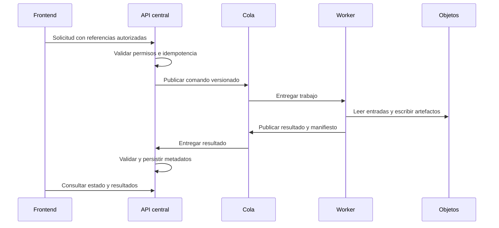

# 17 — Arquitectura DBI-ARC-001

## Identificación

- Ticket: `DBI-ARC-001`
- Issue: #8
- Fecha: 2026-07-28
- Rama: `architecture/DBI-ARC-001-limites-contratos`
- Base: `main` en `14775cf6b4cd8afa47e22e1728ad44cc55187509`
- Pull request: #9
- Estado: completado

## Objetivo

Definir una arquitectura implementable para integrar los sistemas existentes
sin conectarlos todavía, sin tocar servicios operativos y sin confundir el
estado actual con el estado objetivo.

Este documento utiliza tres etiquetas:

- **Confirmado:** existe evidencia directa en el código de `main`.
- **Decisión:** límite aprobado por este ticket.
- **Futuro:** requiere otro ticket; no existe todavía.

## Método y evidencia revisada

La revisión se realizó sobre `main` y cubrió:

- los 12 routers definidos por
  `apps/platform-web/backend/app/api/v1/__init__.py`, de los cuales 11 se
  montan siempre y `documents` depende de `ENABLE_DOCS`;
- los siete modelos SQLAlchemy de `apps/platform-web/backend/app/models`;
- `Settings`, `SessionLocal` y el middleware de
  `apps/platform-web/backend/app/main.py`;
- las rutas Flask y `procesar_mensaje_agrupado()` del bot;
- los cinco conjuntos de encabezados y `SheetsManager`;
- los 18 comandos de `services/banana-density/main.py`;
- las 17 etapas, el estado reanudable y los manifiestos de
  `services/banana-density/src/banana_analyzer/pipeline_orchestrator.py`;
- el cliente HTTP y las rutas activas del frontend React;
- los informes `DBI-SEC-001`, `DBI-CI-002` y `DBI-REPO-001`.

No se consultaron Render, PostgreSQL, Green API ni Google Sheets.

## Arquitectura actual confirmada

### Backend FastAPI

`apps/platform-web/backend/app/main.py` crea la aplicación titulada
`SST Compliance API`, monta `get_api_router()` bajo `/api/v1` y aplica un
middleware de suscripción.

Los routers existentes cubren:

- salud;
- autenticación;
- usuarios;
- empresas;
- archivos;
- suscripciones;
- plantillas;
- banderas del sistema;
- IPERC;
- psicosocial;
- asistente de incidentes;
- documentos.

Los modelos existentes representan `users`, `companies`, `subscriptions`,
`documents`, `document_templates`, `iperc_items` y `admin_audit_logs`.

**Confirmado:** esta base aporta capacidades de plataforma reutilizables.

**Riesgo:** sigue acoplada a `DATABASE_URL`, al dominio SST y a tres cabezas
Alembic heredadas. No contiene todavía finca, lote, campaña geoespacial,
trabajo, artefacto, hallazgo agronómico o registro de modelo DBI.

### Frontend React

`apps/platform-web/frontend/src/app/api.ts` centraliza Axios y
`src/app/routes.tsx` define las pantallas activas. El frontend consume HTTP y no
importa backend, bot o motor geoespacial.

**Confirmado:** el límite técnico del frontend ya es compatible con el diseño
objetivo.

**Riesgo:** las pantallas y contratos actuales pertenecen principalmente al
dominio SST; el dashboard agrícola todavía no existe.

### Bot de WhatsApp

`apps/whatsapp-bot/webhook.py` expone:

- `GET /`;
- `GET /documentos/<path:filename>`;
- `POST /webhook`.

`procesar_mensaje_agrupado()` obtiene y guarda estado, actualiza contactos,
registra o modifica citas, registra conversaciones sin cierre, envía respuestas
y dispara notificaciones.

`google_sheets_utils.py` usa cinco hojas:

- `Contactos`;
- `Mensajes`;
- `Citas`;
- `Conversaciones_Sin_Cierre`;
- `Estados_Conversacion`.

**Confirmado:** `manejar_conversacion()` está separado de Green API, pero el
webhook combina orquestación, transporte y persistencia.

**Riesgo:** una sustitución directa de Sheets o Green API podría romper el flujo
productivo. La migración debe usar un adaptador y una transición verificable.

### Motor geoespacial

`services/banana-density/main.py` ofrece 18 comandos, incluido
`run-full-analysis`. El orquestador ejecuta cuatro etapas iniciales y trece
etapas de procesamiento:

1. verificación del entorno;
2. validación de la ortofoto;
3. validación del límite;
4. recorte;
5. generación de teselas;
6. inferencia YOLO;
7. georreferenciación;
8. exportación GIS preliminar;
9. deduplicación;
10. estadísticas;
11. patrón espacial;
12. densidad por hexágonos;
13. oportunidades de siembra;
14. priorización operativa;
15. KDE;
16. paquete cartográfico;
17. informe técnico.

El pipeline conserva configuración, estado, manifiestos, CSV, GeoPackage,
GeoTIFF y PDF dentro de un directorio de ejecución.

**Confirmado:** ya existe una frontera natural de trabajo y artefactos.

**Riesgo:** las entradas actuales son rutas locales y el proceso requiere
dependencias pesadas. No es seguro importarlo dentro de FastAPI ni ejecutarlo
durante una petición HTTP.

## Decisión de componentes

| Componente | Responsabilidad objetivo | No será responsable de |
|---|---|---|
| API central | Identidad, autorización, dominio, trabajos, trazabilidad y auditoría | Inferencia YOLO o procesamiento de ráster |
| Frontend / PWA | Interacción humana y visualización autorizada | Acceso directo a base o almacenamiento |
| Adaptador WhatsApp | Transporte Green API y traducción de eventos | Fuente canónica permanente |
| Cola | Entrega durable de comandos y resultados | Almacenamiento de dominio |
| Worker geoespacial | Ejecución reproducible del pipeline | Identidad, permisos o escritura directa de dominio |
| PostgreSQL/PostGIS DBI | Datos transaccionales, geometrías consultables y auditoría | Binarios pesados |
| Almacenamiento de objetos | Ortofotos, modelos y artefactos inmutables | Reglas de negocio |

## Flujo futuro de un análisis



Esta secuencia es **futura**. `DBI-ARC-001` no implementa cola, comandos,
consumidores ni endpoints.

## Estados del trabajo

El contrato objetivo distingue el estado del trabajo de la etapa interna del
pipeline.

### Estado del trabajo

```text
accepted → queued → running → succeeded
                            ↘ failed
queued/running → cancel_requested → canceled
failed → queued  (solo mediante reintento autorizado)
```

Reglas:

- `request_id` evita crear dos trabajos por la misma solicitud.
- Cada intento tiene identidad propia y conserva el vínculo al trabajo.
- Un reintento no reemplaza artefactos ya publicados.
- Solo una transición válida puede modificar el estado.
- La cancelación es cooperativa; no se declara completada hasta que el worker
  confirme la detención.

### Estado de etapa

Los valores actuales `pending`, `running`, `completed`, `failed` y `skipped`
pueden conservarse dentro del manifiesto del worker. No sustituyen el estado
global del trabajo.

## Contratos conceptuales v1

Los siguientes ejemplos expresan campos y semántica. Son **futuros** y no
representan endpoints, tablas o colas existentes.

### Comando de análisis

```json
{
  "schema_version": "analysis-job-command.v1",
  "request_id": "idempotency-reference",
  "correlation_id": "trace-reference",
  "job_id": "internal-job-reference",
  "tenant_id": "internal-tenant-reference",
  "farm_id": "internal-farm-reference",
  "lot_id": "internal-lot-reference",
  "inputs": {
    "orthophoto_asset_id": "authorized-asset-reference",
    "boundary_asset_id": "authorized-asset-reference",
    "exclusions_asset_id": null
  },
  "model_version_id": "approved-model-version-reference",
  "pipeline_config_version": "version-reference",
  "requested_by": "internal-user-reference"
}
```

Controles:

- no contiene credenciales;
- no contiene rutas locales;
- los activos pertenecen al mismo tenant;
- la versión del modelo está aprobada para el ambiente;
- la configuración queda inmutable durante el intento.

### Resultado del trabajo

```json
{
  "schema_version": "analysis-job-result.v1",
  "correlation_id": "trace-reference",
  "job_id": "internal-job-reference",
  "attempt_id": "internal-attempt-reference",
  "status": "succeeded",
  "pipeline_build": "worker-build-reference",
  "started_at": "timestamp",
  "finished_at": "timestamp",
  "artifacts": [],
  "metrics": {},
  "findings": [],
  "warnings": [],
  "errors": []
}
```

El consumidor valida versión, identidad, transición, huellas y pertenencia
antes de persistir resultados.

### Manifiesto de artefacto

```json
{
  "schema_version": "artifact-manifest.v1",
  "artifact_id": "internal-artifact-reference",
  "job_id": "internal-job-reference",
  "role": "validated_inventory",
  "object_key": "server-issued-object-reference",
  "content_type": "application/geopackage+sqlite3",
  "size_bytes": 0,
  "sha256": "hexadecimal-checksum",
  "produced_by_stage": "deduplicate_detections",
  "crs": null,
  "created_at": "timestamp"
}
```

`size_bytes: 0` y `crs: null` son marcadores de estructura, no resultados de
una ejecución.

### Hallazgo agronómico

```json
{
  "schema_version": "agronomic-finding.v1",
  "finding_id": "internal-finding-reference",
  "job_id": "internal-job-reference",
  "classification": "inference",
  "statement": "technical-statement",
  "source_artifact_ids": [],
  "technical_source_refs": [],
  "model_version_id": "model-version-reference",
  "confidence": {
    "level": "medium",
    "score": null,
    "method": "documented-method-reference"
  },
  "professional_review": {
    "status": "pending",
    "reviewer_id": null,
    "reviewed_at": null
  }
}
```

Clasificaciones:

- `observed`: dato observado mediante medición o detección registrada;
- `inference`: inferencia calculada a partir de datos observados;
- `hypothesis`: hipótesis o explicación posible aún no confirmada;
- `recommendation`: acción propuesta que requiere revisión profesional.

Cada hallazgo conserva su fuente técnica, los artefactos que lo sustentan y el
método usado para asignar confianza. Un nivel de confianza no equivale a
aprobación profesional.

### Evento del adaptador WhatsApp

```json
{
  "schema_version": "whatsapp-event.v1",
  "correlation_id": "trace-reference",
  "external_message_id": "provider-message-reference",
  "external_contact_ref": "protected-contact-reference",
  "direction": "inbound",
  "content_type": "text",
  "occurred_at": "timestamp",
  "payload_ref": "protected-payload-reference"
}
```

El contrato evita transportar credenciales y limita la exposición de teléfono,
mensaje y ubicación. Su implementación deberá conservar idempotencia con
`external_message_id`.

## Gobierno Champion/Challenger

Un registro futuro de versión de modelo deberá contener:

- identificador y huella del archivo;
- arquitectura y versión de dependencias;
- procedencia y versión del dataset;
- partición de entrenamiento, validación y prueba;
- métricas por finca y condiciones de captura;
- parámetros de inferencia;
- limitaciones y ámbito autorizado;
- estado `candidate`, `challenger`, `champion`, `retired` o `rejected`;
- aprobador, fecha y evidencia de la decisión.

Flujo:

1. registrar candidato;
2. ejecutar evaluación reproducible;
3. comparar Challenger y Champion con el mismo protocolo;
4. revisar efectos agronómicos y operativos;
5. aprobar o rechazar;
6. desplegar por ambiente;
7. vigilar deriva y conservar reversión.

Ninguna métrica aislada autoriza una promoción automática.

## Transición del bot

La transición seguirá un patrón de sustitución gradual:

1. congelar y documentar los contratos actuales de Sheets;
2. implementar un cliente de API detrás de una interfaz del bot;
3. probar con datos sintéticos y sin Green API;
4. ejecutar conciliación de lectura;
5. elegir una única fuente canónica por capacidad;
6. realizar corte autorizado y reversible;
7. mantener Sheets como exportación temporal si se requiere;
8. retirar escrituras antiguas solo después de verificar paridad.

No se realizará doble escritura indefinida ni se cambiarán
`webhook.py`, `gestor_conversacion.py`, `google_sheets_utils.py` o
`green_api_client.py` dentro de `DBI-ARC-001`.

## Seguridad y observabilidad

- Separar identidad de usuario, servicio y worker.
- Autorizar cada recurso por tenant y finca.
- Generar referencias de objeto desde el servidor.
- Mantener buckets privados y accesos temporales.
- No incluir secretos ni datos personales completos en logs.
- Propagar `correlation_id`, `job_id` y `attempt_id`.
- Registrar actor, acción, recurso, resultado y fecha en auditoría.
- Aplicar límites de tamaño, tiempo, memoria y concurrencia.
- Verificar tipo, huella y pertenencia de cada entrada y salida.
- Cifrar transporte y almacenamiento según el ambiente.

## Riesgos y tratamientos

| Riesgo confirmado | Tratamiento posterior |
|---|---|
| `DATABASE_URL` heredada | `DBI-DATA-001` introduce `DBI_DATABASE_URL` aislada |
| Tres cabezas Alembic | Diseñar historial DBI independiente antes de migrar |
| Middleware permisivo | Ticket de autorización con política y pruebas |
| Bot acoplado a Sheets | Adaptador, conciliación y corte por capacidad |
| Pipeline con rutas locales | Adaptador de activos y almacenamiento de objetos |
| PyTorch/GDAL en el motor | Imagen y runner separados del proceso API |
| Artefactos pesados | Almacenamiento privado con manifiesto y huella |
| Datos personales del bot | Minimización, protección y auditoría |
| Resultados agronómicos ambiguos | Clasificación, confianza y aprobación |
| Modelos sin registro central | Registro y evaluación Champion/Challenger |

## Secuencia de implementación propuesta

1. `DBI-DATA-001`: configuración de base DBI, roles e historial Alembic
   independiente en ambientes no productivos.
2. Esqueleto del dominio agrícola y contratos versionados.
3. Gestión de activos y manifiestos en almacenamiento de objetos.
4. Cola, estados, idempotencia y consumidor de resultados.
5. Adaptador del pipeline existente como worker.
6. Dashboard agrícola y visualización cronológica.
7. Adaptador del bot, conciliación y corte de Sheets.
8. Registro de modelos, evaluación Champion/Challenger y observabilidad.

Cada paso requerirá su propio Issue, rama, pruebas y aprobación. Esta secuencia
no crea esos tickets ni autoriza despliegues.

## Criterios de aceptación y evidencia

| Criterio | Evidencia prevista |
|---|---|
| Arquitectura actual basada en código | Rutas, modelos, funciones y etapas identificados |
| Límites objetivo | Matriz de responsabilidades y dependencias |
| Propiedad de datos | Tabla de fuentes canónicas |
| Contratos conceptuales | Cinco ejemplos JSON válidos |
| Trazabilidad agronómica | Clasificación, confianza y revisión profesional |
| Gobierno de modelos | Flujo Champion/Challenger |
| Transición segura | Secuencia de datos, worker y bot |
| Sin integración prematura | Diff documental y CI sin servicios operativos |

## Validaciones ejecutadas

| Verificación | Resultado |
|---|---|
| Inventario de routers, modelos, funciones y etapas sobre `main` | Aprobado |
| Diff remoto limitado a cuatro documentos | Aprobado |
| Rama respecto de `main` | Cero commits por detrás |
| Coincidencia entre contenido local validado y contenido remoto | Aprobada |
| Markdownlint | Cero errores; longitud de filas de tablas excluida |
| Ejemplos JSON | Cinco de cinco válidos |
| Decisiones técnicas | `DEC-001` a `DEC-013`, consecutivas |
| GitHub Actions `30420556081` | Primera ejecución: seis de seis trabajos aprobados |
| GitHub Actions `30420731911` | Ejecución posterior a las precisiones: seis de seis aprobados |
| GitHub Actions `30420894766` | Ejecución definitiva sobre `9e8a1b0e`: seis de seis aprobados |

GitHub Actions validó higiene, secretos, frontend, backend, bot y motor de
densidad. Los smoke tests conservaron el aislamiento definido en `DBI-CI-002`;
no utilizaron credenciales ni servicios operativos.

## Exclusiones confirmadas

- No se modifica código funcional.
- No se crean endpoints, tablas o migraciones.
- No se consulta ni modifica PostgreSQL.
- No se consulta ni modifica Render.
- No se llama Green API ni Google Sheets.
- No se procesa una ortofoto.
- No se descarga ni actualiza un modelo.
- No se cambia la lógica conversacional.
