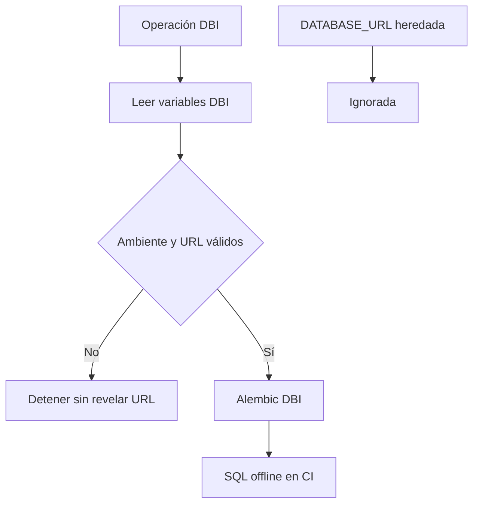

# 18 — Aislamiento de datos DBI-DATA-001

## Identificación

- Ticket: `DBI-DATA-001`
- Issue: #10
- Fecha: 2026-07-29
- Rama: `feat/DBI-DATA-001-aislamiento-base-dbi`
- Base: `main` en `59652b8afe97ca59991547c1d39ab4fd56bcb38e`
- Pull request: #11
- Estado: completado

## Objetivo

Crear una frontera técnica verificable entre las bases heredadas y el futuro
almacenamiento PostgreSQL/PostGIS de DALGORO Banana Intelligence.

El ticket implementa configuración y control de migraciones. No aprovisiona
infraestructura, no abre conexiones y no crea objetos en una base.

## Evidencia revisada

La revisión se realizó sobre `main` y confirmó:

- `app/core/config.py` exige `DATABASE_URL`;
- `app/db/session.py` crea el motor heredado durante la importación;
- `alembic/env.py` usa `settings.DATABASE_URL`;
- `alembic/` conserva las cabezas `20260411_01`, `2cec060d9aa4` y
  `7ce73aae44ce`;
- `alembic.ini` contiene una URL de ejemplo del sistema importado;
- CI ejecuta `alembic heads` y usa SQLite en memoria para el smoke test;
- `DEC-005` exige aislamiento físico, variables DBI e historial independiente;
- `DBI-ARC-001` prohíbe integrar el dominio nuevo antes de este aislamiento.

No se consultaron PostgreSQL, Render u otros servicios externos.

## Riesgo controlado

| Riesgo | Barrera implementada |
|---|---|
| Reutilizar `DATABASE_URL` | El cargador DBI no lee esa variable |
| Apuntar a SQLite u otro motor | Solo se aceptan URLs PostgreSQL |
| Migrar una base con nombre incorrecto | Lista exacta por ambiente |
| Mezclar revisiones heredadas | Directorio y archivo INI independientes |
| Compartir la tabla de versión | `alembic_version_dbi` |
| Crear tablas antes del modelo aprobado | Revisión inicial vacía |
| Conectarse durante CI | Prueba Alembic exclusivamente offline |
| Exponer una URL en errores | Mensajes sin usuario, clave, host o URL |

## Invariantes de aislamiento

1. Una operación DBI necesita `DBI_ENVIRONMENT`.
2. Una operación DBI necesita `DBI_DATABASE_URL`.
3. `DATABASE_URL` no sustituye ninguna de esas variables.
4. El motor debe ser PostgreSQL.
5. El nombre debe coincidir exactamente con el ambiente.
6. La carga de configuración no crea motores o sesiones.
7. El historial DBI no importa modelos heredados.
8. Una migración online no forma parte de CI ni de este ticket.

## Ambientes autorizados

| `DBI_ENVIRONMENT` | Nombre de base autorizado |
|---|---|
| `development` | `dbi_development` |
| `test` | `dbi_test` |
| `staging` | `dbi_staging` |
| `production` | `dbi_production` |

Los nombres se validan después de analizar la URL con SQLAlchemy. No se usa una
comparación parcial ni un prefijo configurable que pueda ampliarse
accidentalmente.

## Flujo de decisión

La rama no añade un camino desde `DATABASE_URL` hacia Alembic DBI.

## Implementación por archivo

### `app/db/dbi_config.py`

`load_dbi_database_config()`:

- acepta un `Mapping` para permitir pruebas sin mutar el entorno;
- lee solo `DBI_ENVIRONMENT` y `DBI_DATABASE_URL`;
- normaliza el ambiente;
- analiza la URL mediante `sqlalchemy.engine.make_url`;
- acepta `postgresql`, `postgresql+psycopg` y
  `postgresql+psycopg2`;
- exige usuario y host;
- compara el nombre con la lista exacta del ambiente;
- devuelve `DBIDatabaseConfig` sin abrir conexiones.

`DBIDatabaseConfigurationError` usa mensajes estables que no incorporan el
valor de la URL ni la excepción del analizador.

### `app/db/dbi_base.py`

`DBIBase` establece metadatos SQLAlchemy independientes. Ninguno de los siete
modelos heredados se importa en esta base.

No existen todavía modelos de finca, lote, campaña, trabajo, artefacto o
hallazgo.

### `dbi_alembic.ini`

El archivo:

- fija `script_location` en `dbi_alembic`;
- no contiene una URL utilizable;
- permite que `env.py` inyecte únicamente la URL DBI validada;
- no modifica `alembic.ini`.

### `dbi_alembic/env.py`

El entorno:

- importa `DBIBase`, no `app.db.base`;
- obtiene configuración con `load_dbi_database_config()`;
- usa `alembic_version_dbi`;
- admite SQL offline para CI;
- conserva un camino online estándar, sujeto a variables válidas y aprobación
  operativa;
- no se ejecuta al importar la aplicación FastAPI.

### `dbi_alembic/versions/20260729_01_dbi_baseline.py`

La revisión `dbi_0001_baseline`:

- tiene `down_revision = None`;
- es simultáneamente raíz y cabeza;
- no crea, altera o elimina objetos;
- establece la procedencia del historial futuro.

### `.github/scripts/ci_dbi_database_isolation.py`

El control ejecuta:

- `validate_configuration_barriers()`;
- `validate_migration_graphs()`;
- `validate_offline_sql()`;
- `validate_no_destructive_database_command()`;
- `validate_source_isolation()`.

La prueba confirma los cuatro ambientes válidos y rechaza:

- disponibilidad exclusiva de `DATABASE_URL`;
- SQLite;
- nombre heredado;
- URL sin host;
- ambiente desconocido.

También acepta el formato PostgreSQL sin driver explícito utilizado por algunos
proveedores.

### `.github/workflows/ci.yml`

El trabajo backend:

- compila `app`, `alembic` y `dbi_alembic`;
- enumera las cabezas heredadas;
- enumera la cabeza DBI;
- ejecuta el control de aislamiento;
- mantiene el smoke test FastAPI existente.

No se añaden secretos, contenedores PostgreSQL o servicios de red.

### `.env.example`

El ejemplo separa visualmente:

- la URL heredada, conservada para compatibilidad;
- `DBI_ENVIRONMENT`;
- `DBI_DATABASE_URL` con credenciales de marcador.

El archivo no contiene una contraseña real y no se usa durante CI.

## Historial de migraciones

| Propiedad | Heredado | DBI |
|---|---|---|
| Configuración | `alembic.ini` | `dbi_alembic.ini` |
| Scripts | `alembic/` | `dbi_alembic/` |
| Metadatos | `app.db.base.Base` | `app.db.dbi_base.DBIBase` |
| Variable | `DATABASE_URL` | `DBI_DATABASE_URL` |
| Tabla de versión | predeterminada | `alembic_version_dbi` |
| Cabezas | tres heredadas | `dbi_0001_baseline` |

`DBI-DATA-001` no fusiona, reescribe o elimina ninguna revisión heredada.

## Validaciones locales ejecutadas

| Verificación | Resultado |
|---|---|
| `compileall` de módulos y migraciones | Aprobado |
| `pip check` focalizado | Aprobado |
| Cabezas heredadas | Tres, sin cambios |
| Base y cabeza DBI | `dbi_0001_baseline` |
| Cuatro ambientes válidos | Aprobados |
| Cinco escenarios no autorizados | Rechazados |
| URL PostgreSQL de proveedor | Aceptada |
| Generación Alembic offline | Aprobada |
| Tabla `alembic_version_dbi` en SQL | Confirmada |
| Tablas heredadas en SQL DBI | Ausentes |
| `DROP DATABASE` | Ausente |
| Conexiones externas | Cero |

Las pruebas focalizadas usaron Alembic 1.17.0 y SQLAlchemy 2.0.44, las versiones
fijadas por `requirements.txt`.

## Validación remota

GitHub Actions aprobó dos ejecuciones completas:

- `30448937826`: seis de seis trabajos sobre el SHA técnico inicial
  `a390d466`;
- `30449255042`: seis de seis trabajos sobre el SHA técnico final
  `58e0e39a`.

En la ejecución final aprobaron higiene del repositorio, frontend, backend,
bot de WhatsApp, motor de densidad y detección de secretos. Dentro del trabajo
backend aprobaron instalación completa, `pip check`, compilación, grafos
Alembic heredado y DBI, aislamiento y SQL offline, smoke test FastAPI y
auditoría informativa de dependencias.

## Criterios de aceptación

| Criterio | Evidencia |
|---|---|
| Ignorar `DATABASE_URL` | Caso heredado sin variable DBI es rechazado |
| Validar motor y ambiente | Matriz positiva y negativa |
| Proteger credenciales | Aserciones sobre mensajes de error |
| Historial independiente | INI, directorio, metadatos y tabla propios |
| Conservar historial heredado | Tres cabezas verificadas |
| Evitar integración prematura | Revisión inicial sin operaciones |
| Evitar conexiones en CI | `command.upgrade(..., sql=True)` |
| Documentar estado real | Arquitectura, decisión, estado e informe |
| Aprobar workflow remoto | GitHub Actions `30449255042`: seis de seis |

## Fuentes técnicas

- [Alembic — Tutorial y entornos de migración](https://alembic.sqlalchemy.org/en/latest/tutorial.html)
- [SQLAlchemy — Database URLs](https://docs.sqlalchemy.org/en/20/core/engines.html#database-urls)

Alembic documenta que cada aplicación o base puede mantener un entorno de
migración con nombre propio. SQLAlchemy documenta el análisis estructurado de
URLs utilizado para validar driver, host y nombre sin manipulación manual.

## Riesgos residuales

- La base DBI todavía no existe.
- Los roles separados todavía no existen.
- PostGIS todavía no está habilitado.
- El camino online existe por necesidad de Alembic, pero no fue ejecutado.
- Los módulos heredados siguen conectados a `DATABASE_URL`.
- La futura infraestructura deberá garantizar aislamiento físico además de
  estas barreras de aplicación.

## Exclusiones confirmadas

- No se consultó ni modificó PostgreSQL.
- No se ejecutó una migración online.
- No se crearon tablas, esquemas, extensiones, bases o roles.
- No se modificaron migraciones heredadas.
- No se modificaron Render, Green API o Google Sheets.
- No se modificaron frontend, bot o motor geoespacial.
- No se procesaron ortofotos.
- No se descargaron o promovieron modelos de IA.
