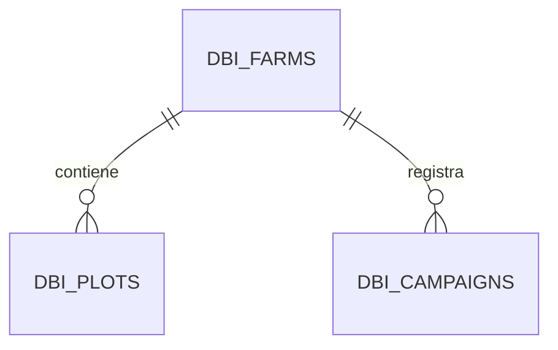

# 20 — Dominio agrícola DBI-DATA-002

## Identificación

- Ticket: `DBI-DATA-002`
- Issue: #14
- Fecha: 2026-07-29
- Rama: `feat/DBI-DATA-002-dominio-agricola-v1`
- Base: `main` en `de5a5412a254c7d382c98ac4284e948e217fee2a`
- Pull request: #15
- Estado: en revisión

## Objetivo

Implementar el primer esquema persistente del dominio agrícola de DALGORO
Banana Intelligence sobre la base declarativa y el historial Alembic aislados
por `DBI-DATA-001`.

El corte define finca, lote y campaña. No crea infraestructura, no ejecuta
migraciones online y no conecta todavía el mapa cronológico con una base.

## Evidencia revisada

La revisión de `main` confirmó:

- `DBIBase` no contenía modelos;
- `dbi_0001_baseline` era una revisión vacía;
- `farm-map-timeline.v1` usa una referencia de finca opaca;
- el mapa devuelve una cronología vacía mientras no exista persistencia;
- la arquitectura ordena implementar finca, lote y campaña antes del worker;
- `DBI_DATABASE_URL` y el historial DBI permanecen aislados de los módulos
  heredados;
- PostGIS, roles y bases reales todavía no existen.

No se consultaron PostgreSQL, Render u otros servicios externos.

## Modelo implementado



El diagrama expresa únicamente relaciones transaccionales. No representa
geometrías, pertenencia de usuarios, trabajos o artefactos.

### Finca

La tabla `dbi_farms` contiene:

| Campo | Tipo | Regla |
|---|---|---|
| `id` | UUID | Clave primaria interna |
| `organization_ref` | texto de 128 | Referencia opaca obligatoria |
| `code` | texto de 64 | Único dentro de la organización |
| `name` | texto de 160 | Obligatorio |
| `status` | texto de 16 | `active`, `inactive` o `archived` |
| `created_at` | fecha UTC | Obligatoria |
| `updated_at` | fecha UTC | Obligatoria |

`organization_ref` no tiene una clave foránea hacia `companies`. Esa tabla
pertenece al sistema heredado y no se convierte silenciosamente en autoridad
del dominio DBI.

### Lote

La tabla `dbi_plots` contiene:

| Campo | Tipo | Regla |
|---|---|---|
| `id` | UUID | Clave primaria interna |
| `farm_id` | UUID | Clave foránea a `dbi_farms` |
| `code` | texto de 64 | Único dentro de la finca |
| `name` | texto de 160 | Obligatorio |
| `area_hectares` | decimal 12,4 | Opcional y mayor que cero |
| `status` | texto de 16 | `active`, `inactive` o `archived` |
| `created_at` | fecha UTC | Obligatoria |
| `updated_at` | fecha UTC | Obligatoria |

El área es un atributo declarado, no una superficie calculada desde una
geometría. Su procedencia y verificación profesional deberán definirse cuando
existan contratos de captura y auditoría.

### Campaña

La tabla `dbi_campaigns` contiene:

| Campo | Tipo | Regla |
|---|---|---|
| `id` | UUID | Clave primaria interna |
| `farm_id` | UUID | Clave foránea a `dbi_farms` |
| `code` | texto de 64 | Único dentro de la finca |
| `name` | texto de 160 | Obligatorio |
| `starts_at` | fecha UTC | Obligatoria |
| `ends_at` | fecha UTC | Opcional y no anterior al inicio |
| `status` | texto de 16 | `planned`, `active`, `completed` o `cancelled` |
| `created_at` | fecha UTC | Obligatoria |
| `updated_at` | fecha UTC | Obligatoria |

La campaña se registra a nivel de finca en este corte. La relación de una
campaña con uno o varios lotes requerirá un contrato específico; no se infiere
ni se crea una tabla asociativa sin ese alcance.

## Identificadores y extensiones

Los tres modelos usan `sqlalchemy.Uuid` y generan UUID en la aplicación. La
migración no usa:

- `gen_random_uuid()`;
- `uuid_generate_v4()`;
- `pgcrypto`;
- `uuid-ossp`;
- PostGIS.

Así, el esquema no introduce una extensión antes de que exista infraestructura
y aprobación operativa.

## Convención de nombres

`DBIBase` incorpora una convención para claves primarias, foráneas, índices,
unicidad y restricciones. La revisión Alembic usa los mismos identificadores:

- `pk_dbi_farms`, `pk_dbi_plots` y `pk_dbi_campaigns`;
- `fk_dbi_plots_farm_id_dbi_farms`;
- `fk_dbi_campaigns_farm_id_dbi_farms`;
- unicidad por organización o finca;
- restricciones de estado, área y orden temporal.

La convención evita diferencias artificiales en futuras comparaciones de
metadatos.

## Historial Alembic

La secuencia DBI queda:

```text
dbi_0001_baseline
└── dbi_0002_agricultural_domain
```

`dbi_0002_agricultural_domain` crea las tablas en orden finca, lote y campaña.
Su reversión las retira en orden inverso.

La revisión no:

- habilita extensiones;
- crea usuarios, empresas o documentos heredados;
- inserta fincas, lotes o campañas;
- crea geometrías;
- abre conexiones por sí misma.

## Implementación por archivo

### Modelos

- `app/db/dbi_base.py`: convención estable de nombres DBI.
- `app/dbi/__init__.py`: frontera del dominio nuevo.
- `app/dbi/models/__init__.py`: exportación explícita de modelos.
- `app/dbi/models/agriculture.py`: `Farm`, `Plot` y `Campaign`.

### Migración

- `dbi_alembic/env.py`: registra únicamente los modelos DBI.
- `dbi_alembic/versions/20260729_02_agricultural_domain.py`: segunda revisión
  del historial independiente.

### Integración continua

- `.github/scripts/ci_dbi_database_isolation.py`: reconoce la nueva cabeza sin
  alterar las tres cabezas heredadas.
- `.github/scripts/ci_dbi_domain.py`: inspecciona metadatos, restricciones,
  grafo, fuentes y SQL offline.
- `.github/workflows/ci.yml`: ejecuta el nuevo control en el trabajo backend.

## Validaciones locales ejecutadas

| Verificación | Resultado |
|---|---|
| Compilación Python | Aprobada |
| Tres tablas DBI exactas | Aprobado |
| Columnas previstas | Aprobado |
| Claves foráneas de lote y campaña | Aprobado |
| Nombres de restricciones | Aprobado |
| Cabeza `dbi_0002_agricultural_domain` | Aprobada |
| Generación Alembic offline | Aprobada |
| Extensiones y geometrías | Ausentes |
| UUID dependiente de extensión | Ausente |
| Datos sembrados | Ausentes |
| Tablas heredadas en SQL DBI | Ausentes |
| Conexiones externas | Cero |

Las pruebas focalizadas usaron Alembic 1.17.0, SQLAlchemy 2.0.44 y psycopg
3.2.12, versiones fijadas por el backend.

## Validación remota

GitHub Actions `30458247290` aprobó seis de seis trabajos sobre el SHA técnico
`91d5e8ee2706d80e330f6a36868ad8c289c00d91`.

La ejecución confirmó:

- higiene del repositorio y activos canónicos;
- frontend con instalación, lint y build completos;
- backend con dependencias, compilación, ambos grafos Alembic, aislamiento DBI,
  dominio agrícola offline, contrato cartográfico y healthcheck;
- bot de WhatsApp con instalación, compilación y smoke test;
- motor de densidad con dependencias geoespaciales, compilación, importaciones
  y CLI;
- detección de secretos sobre el historial.

## Criterios de aceptación

| Criterio | Evidencia |
|---|---|
| Modelos mínimos | `Farm`, `Plot` y `Campaign` |
| Metadatos aislados | Los tres heredan de `DBIBase` |
| Relaciones | Lote y campaña referencian a finca |
| Unicidad | Organización-finca y finca-código |
| Estados válidos | Restricciones `CHECK` explícitas |
| Historial lineal | Una base y una cabeza DBI |
| Herencia intacta | Control de tres cabezas heredadas |
| SQL seguro | Generación offline sin extensiones |
| CI completa | GitHub Actions `30458247290`: seis de seis |
| Estado documentado | Documentos 01, 06, 13 y 20 |

## Naturaleza de los datos

Este ticket define estructura, no evidencia agronómica:

- dato observado: ninguno;
- inferencia: ninguna;
- hipótesis: ninguna;
- recomendación: ninguna;
- confianza: no aplica;
- aprobación profesional: no aplica.

Los nombres y áreas que se incorporen en el futuro requerirán procedencia y
controles acordes con su uso.

## Riesgos residuales

- La base DBI todavía no existe.
- Los roles DBI todavía no existen.
- No existe sesión o repositorio de acceso DBI.
- No existe autorización de pertenencia a una finca.
- `organization_ref` todavía no referencia una organización canónica DBI.
- Una campaña todavía no se relaciona con lotes individuales.
- No existen geometrías, PostGIS, trabajos o artefactos.
- El mapa cronológico todavía devuelve un estado vacío.

## Exclusiones confirmadas

- No se creó ni consultó una base.
- No se ejecutó una migración online.
- No se creó una tabla o dato real.
- No se habilitó PostGIS ni otra extensión.
- No se añadieron geometrías, ortofotos, tiles o índices.
- No se creó un motor o sesión DBI.
- No se añadieron endpoints.
- No se modificaron migraciones o modelos heredados.
- No se modificaron Render, Green API o Google Sheets.
- No se modificaron frontend, bot o worker geoespacial.
- No se descargaron, actualizaron o promovieron modelos de IA.
